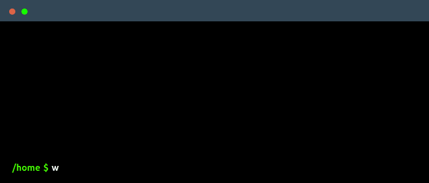

 
      

  

 

<h2> About me </h2>

**Software Engineer** with 2+ years of experience in backend web development and a solid background in **Machine Learning**.  
🔁 Eager to learn. Driven to grow.  
 

<h2> 🎓 Education </h2>

MSc in ICT for Internet and Multimedia @ University of Padova

 
<h2>  Main skills </h2>

 
<h2> 🤝🏻 Connect with Me </h2>

&nbsp; 
&nbsp; 
&nbsp; 

 
